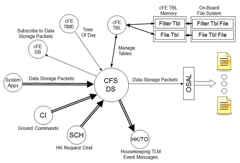

# cFS: Data Storage

* [Original README](cfs-ds-app-OSS-readme.txt)

## Description

The Data Storage application (DS) is a core Flight System (cFS) application that
is a plug in to the Core Flight Executive (cFE) component of the cFS.

The cFS is a platform and project independent reusable software framework and
set of reusable applications developed by NASA Goddard Space Flight Center. This
framework is used as the basis for the flight software for satellite data
systems and instruments, but can be used on other embedded systems. More
information on the cFS can be found at http://cfs.gsfc.nasa.gov

The DS application is used for storing software bus messages in files. These
files are generally stored on a storage device such as a solid state recorder
but they could be stored on any file system. Another cFS application such as
CFDP (CF) must be used in order to transfer the files created by DS from their
onboard storage location to where they will be viewed and processed.

## Requirements

* [Operating System Abstraction Layer][osal] 4.1.1 or higher
* [core Flight Executive][cfe] 6.4.2 or higher
* [cFS Application Library][cfs_lib]

## Sources

* https://sourceforge.net/projects/cfs-ds/

[osal]: https://github.com/lassondesat/osal
[cfe]: https://github.com/lassondesat/coreflightexec
[cfs_lib]: https://github.com/lassondesat/cfs_lib
